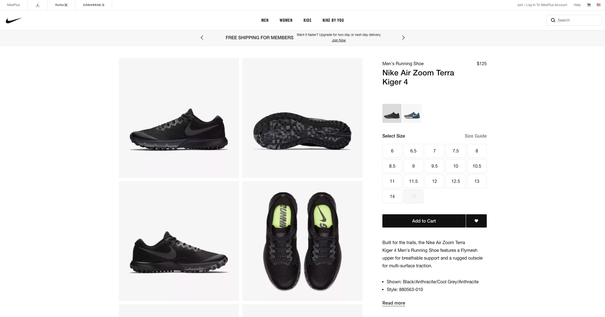
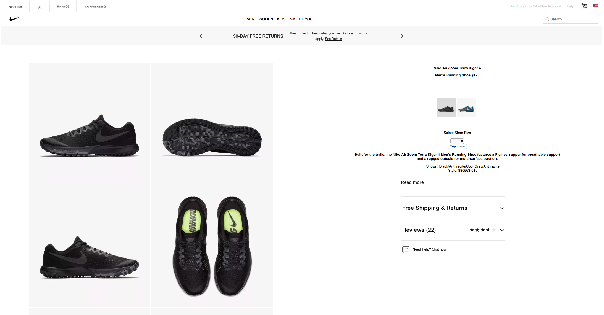
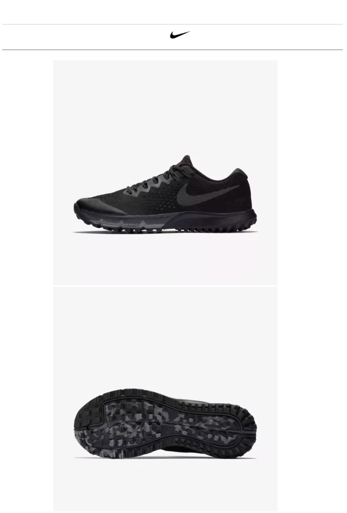

# _Nike clone variation_

#### _This is a clone demonstration displaying knowledge of flexbox usage and responsive web design, 02/15/19_

#### By _**Robbie Kruszynski**_

## Description

* An attempt to clone an e-commerce website, specifically https://www.nike.com/t/air-zoom-terra-kiger-4-mens-running-shoe-OzqzBz/880563-010
to an extent where it is recognizable, but also allowing for freedom to incorporate additions to explore the usage of flexbox.

* An exploration with mixins along with media queries to gain practice with responsive web design pending on viewport.

* The user will experience breakpoints at the following resolutions
* 1995px - right column removes itself
* 768px - right column / nav bars / footer removes itself for clean UI
* First photo is orignial

* Second photo is created project

* Third photo is created project reduced to 768px responsive design active

## Specs
* Spec: When the user visits site all given information is shown provided resolution requirements are met.
* Spec: When the user falls below 1195px there is a breakpoint where the right column will become absent.
* Spec: When the user  falls below 768px there is a breakpoint removing all but one navigation bar and images stored on the left column.

## Setup/Installation Requirements

* Open your preferred browser
* to view live project please visit:
* Or copy / paste be sure you're in your Desktop directory
* clone or download  your Desktop https://github.com/Robbiekruszynski/week-5-project-SCSS.git
* Open the week-5-project and run index.html with your selected browser
* Explore the site!
* For those whom wish to alter or view the code please use your preferred text editor
* Load up the week-5-project directory and open all files with your text editor
* KEEP IN MIND SCSS is spread across a few files in an attempt to build off the 7-1 SASS Architecture

## Known Bugs

_There are no known bugs at this time, however I am experiencing a breakpoint earlier than expected. 1195px level (right column) _

## Support and contact details

_Please contact robbiekruszynski@gmail.com_

## Technologies Used

* HTML
* CSS
* SCSS

### License

*This software is licensed under the MIT license} Copyright (c) 2019*

Copyright (c) 2019 **_Robbie Kruszynski_**
